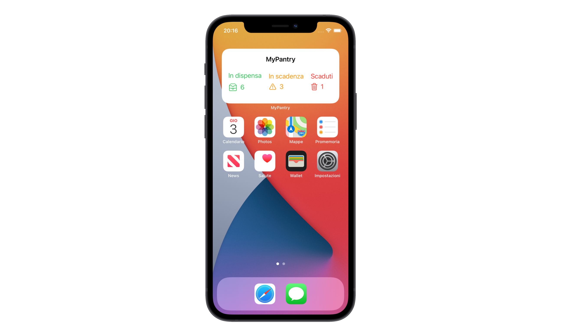
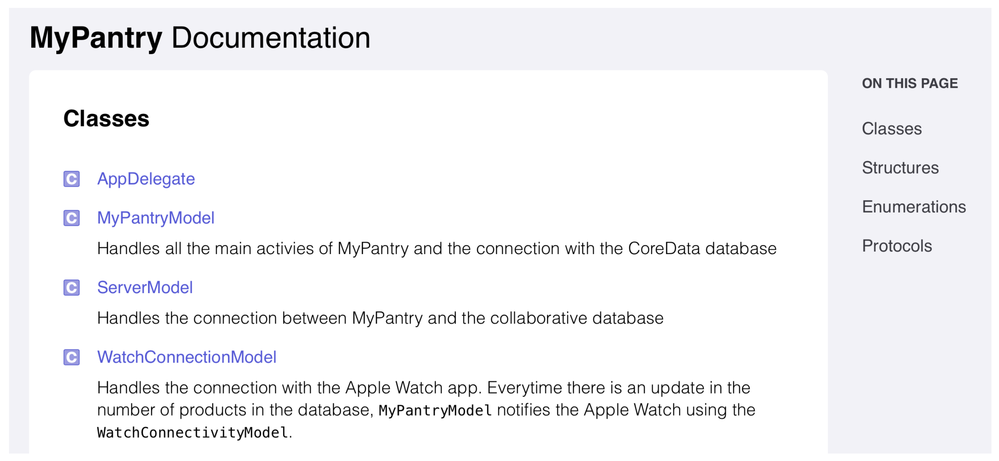

# Introduction 

This document describes the functionality and implementation strategies adopted in developing the iOS app MyPantry, which I developed as a project for the course [Mobile Applications Lab](https://www.unibo.it/it/didattica/insegnamenti/insegnamento/2020/367016)
at the University of Bologna, academic year 2020/2021.

The project is consists of an app called MyPantry, for iOS devices (iPhone, iPad, iPod Touch) which allows the user to monitor the contents of their larder.

The system was implemented using:

-   Xcode 12.4 (build `12D4e`)

-   Swift 5


# Functionalities

The MyPantry application allows the user to enter food products purchased and keep track of their consumption. The following paragraphs describe the functionality of the application. Figure 2 shows the home page of the application on the iPhone and on the Apple Watch.


## Products insertion

Products are entered by scanning or typing in the product *barcode*. The application accesses a remote collaborative *database* (managed by the University) to check if a product is associated with that identifier. If more than one product is present, the user is given the opportunity to choose the correct product and the choice is recorded on the shared database, as described in the paragraph below. 

**Note** I cannot guarantee that the remote server will be accessible in the future.


## Pantry organization

When users enter a product, theys can specify an area of the house in which to store it (e.g. the fridge, the freezer, a certain cupboard,...) and a category to which it belongs (pasta, snacks, sweets,...). Both the *categories* and the areas of the house, called *pantries*, are fully customizable.

## Product information

The application aims to make the management of products in the pantry quick and easy. It is possible to assign an expiry date to a product so that you can quickly see which products should be consumed first and receive a notification when the expiry date is approaching. The application also keeps track of whether products have been opened, so that the user is advised to consume those that have already been opened first. 

From the MyPantry home page, it is possible to access the product lists and search them.


## Shopping list 

Users can easily add consumed products to the shopping list, a dedicated section of the app that reminds the user which products to re-purchase. A product on the shopping list can be reinserted into the pantry instantly, without the need to interact with the collaborative database.

I decided to allow only products previously registered within the application to be added to the shopping list.


## Notifications and summary 

In order to make pantry management as easy as possible and avoid food waste, the MyPantry application includes a notification system that alerts users when a product has an imminent expiry date. In addition, a widget can be placed on the home screen or in the notification centre of the iOS device to keep the user up to date on the pantry situation, displaying the number of products present, the number of products that are about to expire and the number that have expired.

Lastly, I created a watchOS app which allows users who own an Apple Watch to have a summary of the contents of their pantry always available on their wrist.

# Implementation strategies 

This section analyses the main functionalities of MyPantry and discusses the implementation strategies adopted, taking advantage of the libraries offered by Swift 5.

The project was implemented following the *Model View Controller pattern* and the [recommendations provided by Apple](https://developer.apple.com/documentation/swift) for the development of iOS apps. In addition, I followed many suggestions provided by the [Human Interface Guidelines](https://developer.apple.com/design/human-interface-guidelines/ios/) to improve user experience. 


## Database

The developed app uses a local database to save the products inserted by the user and it interacts with a remote collaborative database to associate product information to its *barcode*. 

### Connection to the remote database

In order to keep the project code clean and apply software engineering principles like *high cohesion* and *low coupling*,  I created a class called `ServerModel`, which has the responsibility to handle communications with the remote database. 

Communications with the remote database happen using [URLSession](https://developer.apple.com/documentation/foundation/urlsession)
of the Swift framework `foundation`. 

Responses of the collaborative server are in JSON format. By using the interface [Codable](https://developer.apple.com/documentation/swift/codable/) and [JSONDecoder](https://developer.apple.com/documentation/foundation/jsondecoder/) it is possible to convert in a quick and efficient way the response in the `struct` shown below. 


```swift
struct Product : Codable {
	let id : String
	let name : String
	let description : String
	let barcode : String
	let userId : String
	let test : Bool
	let createdAt : String
	let updatedAt : String
}
```

The code block below shows the functions available on `ServerModel`.

```swift
protocol ServerModelProtocol {
 	func login() throws ->  Void
 	func searchProducts(withBarcode: Barcode) throws -> [Product]
 	func pushNewPantryItem(newProduct item: PantryItem) -> Void
 	func pushProductPreference(preference: Product) -> Void
 	func checkLoginDetails(email: String, password: String) -> Void
 	func register(email: String, password: String, username: String) -> Void
}
```

If the user searches for a *barcode*, but the product is not among those returned by the collaborative database, there is an option to add a new product. The details of that product are uploaded to the collaborative database to be available to other users. If the searched product is among those shown in the list downloaded from the server, the chosen product is communicated to it by the `pushProductPreference` method.

When starting the application for the first time, the user is asked to register on the collaborative database or to use existing credentials. Users can change the login credentials in *Settings*

#### Memo

If an internet connection is not available, it has been decided not to allow the user to add new products to MyPantry in order not to deviate from the project specifications that require the use of the collaborative database.

### Local Database


Products available in the user's pantry are saved in a local database built with `CoreData`. 

The model shown in the picture above has 4 entities:

-   `Pantry`: represents a user-defined area of the home in which products are stored (it can, for example, be a fridge, a freezer or a specific shelf)

-   `Category`: represents a category of products defined by the user (for instance pasta, snacks, desserts, ...)

-   `PantryItem`: represents a product in the pantry. We track the name, *barcode*, a description, the expiry date and if the product has been opened. When a product is consumed and it goes in the archive the value `consumed` is set to `true`. 

-   `ShoppingListItem`: represents a product in the shopping list of which we save the `barcode`, the name and the description, the category and the pantry where it is usually stored. 

Inserting, editing and deleting entities is never done by `ViewController`, but it is a responsibility assigned to `MyPantryModel`.

 
To store user preferences, like, for instance, the willingness to receive notifications, I have used `UserDefaults`, as recommended by Apple. 

## *Barcode* scanning

To simplify the insertion of new product in MyPantry, there is the possibility to scan the *barcode*. 
To implement this functionality, I have used the powerful library [AVFoundation](https://developer.apple.com/av-foundation/)  of Swift. *Barcode* formats recognized by MyPantry are the standards `EAN-8`, `EAN-13`, `PDF417`. 


## Notifications

If the user has enabled notifications for MyPantry, when a new product is entered a notification is scheduled for the day the product will enter the *expiring status* and another notification for the day the product will expire.


The scheduled notifications are deleted if the product is consumed or disposed of before the expiry date.

The `MyPantryModel` does the scheduling of notifications using the iOS framework `NotificationCenter`.

If the user disables notifications from the MyPantry settings, all previously scheduled notifications will be deleted.

## Widget



I created a  widget for MyPantry that shows the number of products in the pantry, the number of products that are about to expire and the number of expired products. In this way the user is always informed about the status of the pantry. 

In order to share information between the Widget, MyPantry, and the Apple Watch
application described in the next paragraph, I  created an `AppGroup`. Sharing of information between MyPantry and the Widget happens using `UserDefaults`. 

MyPantry is a *storyboard-based* application. On the contrary, the Widget was built using SwiftUI. 


## Apple Watch

Lastly, I created an app for Apple Watch that displays the same information as the
information displayed by the Widget. 

However, the system for exchanging information between MyPantry and watchOS is not the same as that used with the Widget. Starting with watchOS 2, Apple removed the ability to create shared user defaults or core data between iOS and watchOS to allow the Apple Watch to be more autonomous from iOS and allow their users to take advantage of the watch
functionalities even when they don't have their iPhone with them. 

Therefore, the sharing of information is more complex and involves asynchronous communications between iOS and Apple Watch. 


The MyPantry iOS application, when started or when it records a change in the product database, sends a message to the Apple Watch application containing the updated number of products in the pantry, expiring and expired products.

The model `WatchConnectionModel` is responsible for establishing the connection with the Apple Watch, and `MyPantryModel` uses it to send messages.

The Apple Watch app, on the other hand, listens for such messages from the iOS app. Whenever it receives a
message with the updated information, it stores the content in its `UserDefaults`, so that the data is accessible in the future, even if the iPhone is not reachable. 

The messages are sent using [`WatchConnectivity`](https://developer.apple.com/documentation/watchconnectivity).


## Documentation

The Swift code has been commented and labelled following the [guidelines](https://developer.apple.com/library/archive/documentation/Xcode/Reference/xcode_markup_formatting_ref/ComentBlock.html)
provided by Apple for projects in Xcode. 

By using [`swift-doc`](https://github.com/SwiftDocOrg/swift-doc) I have generated HTML pages of the documentation, which are available in the folder `docs`. 



---

The original report is written in Italian and it's available in the file `report.pdf`. 
