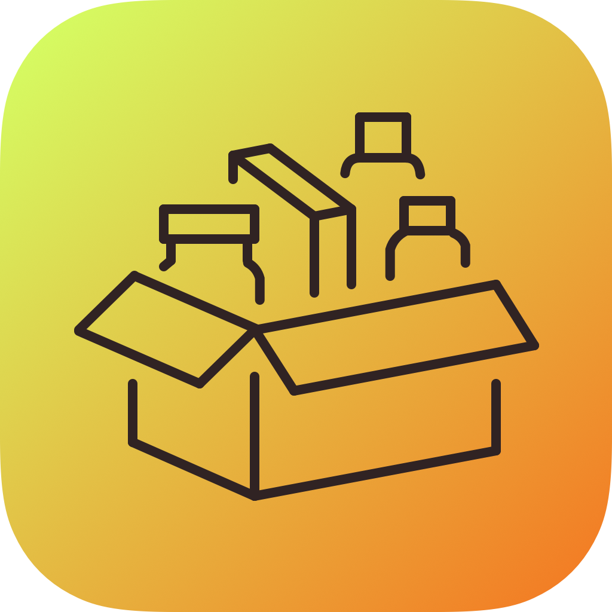

# Introduzione {#introduzione .unnumbered}

Il progetto realizzato è costituito da un'applicazione, chiamata
*MyPantry*, per dispositivi iOS (iPhone, iPad, iPod Touch) che permette
all'utilizzatore di monitorare il contenuto della sua dispensa.

Il sistema è stato realizzato utilizzando:

-   Xcode 12.4 (build `12D4e`)

-   Swift 5

<div style="text-align: center">

</div>

# Funzionalità

L'applicazione *MyPantry* permette all'utente di inserire i prodotti
alimentari acquistati e tenere traccia del loro consumo. Nei paragrafi
successivi vengono descritte le funzionalità dell'applicazione. Nella
figura 2 è possibile vedere la home dell'applicazione su iPhone e su
Apple Watch.

{width="0.25\\paperwidth"}

{width="0.17\\paperwidth"}

## Inserimento dei prodotti

L'inserimento dei prodotti avviene attraverso la scansione o la
digitazione del *barcode* del prodotto. L'applicazione accede ad un
*database* remoto collaborativo per verificare se sia presente un
prodotto associato a quell'identificativo. Qualora siano presenti più
prodotti, all'utente viene data la possibilità di scegliere il prodotto
corretto e la scelta viene registrata sul database condiviso, come
descritto nel paragrafo [2.1.1](#database-remoto){reference-type="ref"
reference="database-remoto"}.

Nel caso in cui nessuno dei prodotti inseriti sul database corrisponda
al prodotto corretto o qualora non sia presente nessuna corrispondenza
per il *barcode* ricercato, l'utente può aggiungere un nuovo prodotto,
che viene messo a disposizione degli altri utenti e dunque caricato sul
database condiviso. I prodotti contenuti nella dispensa dell'utente,
invece, vengono memorizzati su un database locale, come descritto nel
capitolo [2.1.2](#database-locale){reference-type="ref"
reference="database-locale"}.
[\[introduzione-database\]]{#introduzione-database
label="introduzione-database"}

{width="0.25\\paperwidth"}

{width="0.25\\paperwidth"}

{width="0.25\\paperwidth"}

## Organizzazione della dispensa

Quando l'utente inserisce un prodotto può specificare un'area della casa
nella quale riporlo (ad esempio il frigo, il freezer, un determinato
armadio,\...) e una categoria a cui esso appartiene (pasta, snack,
dolci,\...). Sia le *categorie* che le aree della casa, denominate
*dispense*, sono completamente personalizzabili.

## Informazioni sui prodotti

L'obiettivo dell'applicazione è rendere semplice e veloce la gestione
dei prodotti in dispensa. Ad un prodotto può essere assegnata una data
di scadenza, in modo da poter visualizzare velocemente quali siano i
prodotti da consumare prima e ricevere una notifica quando la scadenza
si sta avvicinando. L'applicazione tiene traccia anche dell'eventuale
apertura dei prodotti, in modo da suggerire all'utente di consumare
prima quelli che sono già stati aperti.

Dalla home di *MyPantry*, mostrata in figura 2, è possibile accedere
agli elenchi dei prodotti nei quali è anche possibile effettuare una
ricerca, come mostrato nella figura
[2](#fig:elenco-prodotti){reference-type="ref"
reference="fig:elenco-prodotti"}.

{#fig:elenco-prodotti width="0.25\\paperwidth"}

{#fig:elenco-prodotti
width="0.25\\paperwidth"}

## Lista della spesa

I prodotti consumati possono essere inseriti agevolmente nella *lista
della spesa*, una sezione dedicata della app che permette di ricordare
all'utente quali prodotti deve ri-acquistare. Un prodotto presente nella
lista della spesa può essere reinserito nella dispensa in modo
istantaneo, senza la necessità di interagire con il database
collaborativo.

Si è scelto di consentire l'inserimento nella lista della spesa soltanto
di prodotti precedentemente registrati all'interno dell'applicazione.

{width="0.25\\paperwidth"}

{width="0.25\\paperwidth"}

## Notifiche e riepilogo

Al fine di semplificare al massimo la gestione della dispensa e evitare
lo spreco di generi alimentari, l'applicazione *MyPantry* prevede un
sistema di notifiche che avvisa gli utenti quando un prodotto presenta
una data di scadenza ravvicinata. Inoltre, è stato realizzato un Widget
che l'utente può inserire nella home o nel centro notifiche del proprio
dispositivo iOS per essere sempre aggiornato sulla situazione della
dispensa, visualizzando il numero di prodotti presenti, il numero di
prodotti in scadenza e il numero di quelli scaduti.

Il Widget realizzato è descritto nel capitolo
[2.4](#widget){reference-type="ref" reference="widget"}. Infine, è stata
realizzata una app watchOS che permette agli utenti proprietari di un
*Apple Watch* di avere sempre a disposizione sul loro polso un riepilogo
del contenuto della dispensa (vedi capitolo
[2.5](#watchos){reference-type="ref" reference="watchos"}).

# Strategie di implementazione

In questa sezione si analizzano le principali funzionalità di *MyPantry*
e si discutono le strategie di implementazione adottate, sfruttando le
librerie offerte da Swift 5.

Il progetto è stato realizzato seguendo il pattern *Model View
Controller* e le [raccomandazioni fornite da
Apple](https://developer.apple.com/documentation/swift) per lo sviluppo
di applicazioni in Swift. Inoltre, si è cercato di applicare il più
possibile gli interessanti suggerimenti forniti dalle [Human Interface
Guidelines](https://developer.apple.com/design/human-interface-guidelines/ios/)
per sviluppare un'applicazione gradevole anche dal punto di vista della
*user experience*.

## Database

Come anticipato nel capitolo
[\[introduzione-database\]](#introduzione-database){reference-type="ref"
reference="introduzione-database"}, l'applicazione sviluppata utilizza
un database locale per memorizzare i prodotti inseriti dall'utente e
interagisce con un database remoto collaborativo per associare le
informazioni di un prodotto al *barcode* corrispondente.

### Connessione al database remoto {#database-remoto}

Per mantenere il codice del progetto ordinato e applicare i principi di
ingegneria del software di *alta coesione* e *basso accoppiamento*, è
stata creata una classe denominata `ServerModel` alla quale è stata
assegnata la responsabilità di gestire le comunicazioni con il database
remoto.

La comunicazione con il database remoto avviene sfruttando le
[URLSession](https://developer.apple.com/documentation/foundation/urlsession)
del framework `foundation` di Swift.

Le risposte da parte del server condiviso sono in formato JSON.
Sfruttando l'interfaccia
[Codable](https://developer.apple.com/documentation/swift/codable/) e
[JSONDecoder](https://developer.apple.com/documentation/foundation/jsondecoder/),
è possibile convertire in modo rapido e efficiente la risposta del
server nella `struct` mostrata nel listing
[\[struct-Product\]](#struct-Product){reference-type="ref"
reference="struct-Product"}.

``` {#struct-Product caption="Una \\lstinline|struct| per un prodotto disponibile sul server condiviso" label="struct-Product"}
struct Product : Codable {
	let id : String
	let name : String
	let description : String
	let barcode : String
	let userId : String
	let test : Bool
	let createdAt : String
	let updatedAt : String
}
```

Il listing
[\[server-protocollo\]](#server-protocollo){reference-type="ref"
reference="server-protocollo"}, invece,mostra i metodi disponibili in
`ServerModel`, che corrispondono alle funzionalità richieste dalle
specifiche del progetto.

``` {#server-protocollo caption="I metodi presenti in \\texttt{ServerModel}" label="server-protocollo"}
protocol ServerModelProtocol {
 	func login() throws ->  Void
 	func searchProducts(withBarcode: Barcode) throws -> [Product]
 	func pushNewPantryItem(newProduct item: PantryItem) -> Void
 	func pushProductPreference(preference: Product) -> Void
 	func checkLoginDetails(email: String, password: String) -> Void
 	func register(email: String, password: String, username: String) -> Void
}
```

Se l'utente effettua la ricerca di un *barcode* ma il prodotto non è tra
quelli restituiti dal database collaborativo, vi è la possibilità di
aggiungere un nuovo prodotto. I dettagli di tale prodotto vengono
caricati sul database collaborativo per essere disponibili agli altri
utenti. Se invece il prodotto cercato è tra quelli mostrati nell'elenco
scaricato dal server, il prodotto scelto viene comunicato ad esso
tramite il metodo `pushProductPreference`.

Al primo avvio dell'applicazione viene richiesto all'utente di
registrarsi sul database collaborativo o di utilizzare delle credenziali
esistenti. Le credenziali di accesso possono essere modificate in
*impostazioni*.

#### Nota

Qualora non sia disponibile una connessione a internet, si è deciso di
non consentire all'utente di procedere con l'aggiunta di nuovi prodotti
su *MyPantry* per non derogare alle specifiche del progetto che
prevedono l'obbligatorietà dell'utilizzo del database collaborativo.

### Database locale

{#coredata-model
width="0.5\\paperwidth"}

I prodotti disponibili nella dispensa dell'utente vengono memorizzati in
un database locale realizzato utilizzando `CoreData`.

Il modello del database è mostrato nella figura
[3](#coredata-model){reference-type="ref" reference="coredata-model"} e
prevede quattro entità:

-   `Pantry`: rappresenta un'area della casa definita dall'utente nella
    quale vengono riposti i prodotti acquistati (può ad esempio essere
    il frigo, il freezer o un determinato scaffale)

-   `Category`: rappresenta una categoria di prodotti definita
    dall'utente (può ad esempio essere pasta, snack, dolci,\...)

-   `PantryItem`: rappresenta un prodotto presente nella dispensa. Oltre
    al nome e al *barcode*, si tiene traccia della descrizione, della
    data di scadenza e dell'eventuale apertura del prodotto. Quando un
    prodotto viene consumato finisce nell'archivio della app e il valore
    `consumed` viene impostato a `true`

-   `ShoppingListItem`: rappresenta un prodotto nella lista della spesa,
    del quale si memorizza il `barcode`, il nome, la descrizione, la
    categoria e la dispensa nella quale viene abitualmente inserito

L'inserimento, la modifica e la rimozione di entità non è mai affidata
ai `ViewController` ma è una responsabilità assegnata a `MyPantryModel`.

L'eliminazione di una `Category` o di un `Pantry` segue la politica
*cascade*. Di conseguenza, se l'utente decide di rimuovere una categoria
o una dispensa da MyPantry, vengono eliminati anche tutti i prodotti
associati ad essa.

Per memorizzare le preferenze dell'utente, come ad esempio la volontà di
ricevere notifiche, sono state utilizzate le `UserDefaults`, come
raccomandato da Apple.

## Scansione del *barcode*

Per semplificare e agevolare l'inserimento di nuovi prodotti su
*MyPantry*, è stata prevista la possibilità di scansionare il *barcode*.
Per implementare questa funzionalità, è stato utilizzata la potente
libreria [AVFoundation](https://developer.apple.com/av-foundation/) di
Swift. I formati di barcode riconosciuti da *MyPantry* sono quelli che
rispettano gli standard `EAN-8`, `EAN-13`, `PDF417`[^1].

È comunque lasciata all'utente la possibilità di inserire il *barcode*
manualmente.

## Notifiche

{#fig:impostazioni width="0.25\\paperwidth"}

Dalla pagina delle *Impostazioni*, mostrata in figura
[4](#fig:impostazioni){reference-type="ref"
reference="fig:impostazioni"}, è possibile impostare il numero di giorni
antecedenti la data di scadenza dei prodotti entro i quali un prodotto
viene considerato *in scadenza*.

Se l'utente ha abilitato le notifiche per *MyPantry*, al momento
dell'inserimento di un nuovo prodotto viene programmata una notifica per
il giorno in cui il prodotto entrerà nello stato *in scadenza* e
un'altra notifica per il giorno in cui il prodotto scadrà.

Qualora il prodotto venga consumato o eliminato prima della data di
scadenza, le notifiche programmate vengono eliminate.

La programmazione delle notifiche viene effettuata dal `MyPantryModel`
al momento dell'inserimento di un prodotto, sfruttando il framework di
iOS `NotificationCenter`.

Nel caso in cui l'utente disabilitasse le notifiche dalle impostazioni
di *MyPantry*, tutte le notifiche precedentemente programmate verrebbero
eliminate.

## Widget

{#fig:widget
width="0.25\\paperwidth"}

È stato realizzato un Widget per *MyPantry* che mostra il numero di
prodotti presenti in dispensa, il numero di prodotti in scadenza e il
numero di prodotti scaduti. In questo modo l'utente è sempre informato
sullo stato della dispensa. Uno *screenshot* del Widget è mostrato in
figura [5](#fig:widget){reference-type="ref" reference="fig:widget"}.

Per condividere informazioni tra il Widget, *MyPantry* e l'applicazione
per Apple Watch descritta nel prossimo paragrafo, è stato creato un
`AppGroup`, ovvero un identificativo che permette di raggruppare più
applicazioni e consentire lo scambio di informazioni tra esse.

In particolare, lo scambio di informazioni tra `MyPantry` e il Widget
avviene sfruttando le `UserDefaults`, già utilizzate per memorizzare le
preferenze dell'utente. Ogni volta che viene effettuata una modifica a
qualche prodotto in *MyPantry*, viene aggiornato il numero di prodotti
presenti in dispensa, il numero di prodotti in scadenza e il numero di
quelli scaduti all'interno delle `UserDefaults`. Il Widget accede a
queste informazioni e le mostra all'utente nella home di iOS o nel
centro notifiche.

Il Widget, a differenza di `MyPantry` che è una
*storyboard-application*, è stato realizzato utilizzando interamente
SwiftUI.

## Apple Watch {#watchos}

È stata realizzata una app per Apple Watch che permette di mostrare le
stesse informazioni mostrate dal Widget, descritto nel capitolo
precedente.

Il sistema di scambio delle informazioni tra *MyPantry* e watchOS,
tuttavia, non è lo stesso utilizzato con il Widget. A partire da watchOS
2, infatti, Apple ha rimosso la possibilità di creare `UserDefaults` o
`CoreData` condivisi tra iOS e watchOS, per permettere agli Apple Watch
di essere più autonomi da iOS e consentire ai loro utilizzatori di
sfruttarne funzionalità anche quando non hanno a disposizione il proprio
iPhone.

Di conseguenza, il sistema di comunicazione è più complesso e prevede lo
scambio di messaggi in modo asincrono tra iOS e Apple Watch.

L'applicazione *MyPantry* per iOS, quando viene avviata o quando
registra una modifica nel database dei prodotti, invia all'applicazione
per Apple Watch un messaggio contenente il numero aggiornato di prodotti
in dispensa, in scadenza e scaduti.

Il model `WatchConnectionModel` ha la responsabilità di stabilire la
connessione con Apple Watch ed è utilizzato dal `MyPantryModel` per
inviare i messaggi.

L'applicazione per Apple Watch, invece, rimane in ascolto di messaggi di
questo tipo da parte dell'app per iOS. Ogni volta che riceve un
messaggio con le informazioni aggiornate, memorizza il contenuto nelle
proprie `UserDefaults`, in modo che i dati siano accessibli in futuro
anche nel caso in cui iPhone non fosse raggiungibile.

Lo scambio di messaggi avviene utilizzando il framework
[`WatchConnectivity`](https://developer.apple.com/documentation/watchconnectivity).

{#fig:watch
width="0.25\\paperwidth"}

## Documentazione

Il codice Swift realizzato è stato commentato (in inglese) seguendo le
[linee
guida](https://developer.apple.com/library/archive/documentation/Xcode/Reference/xcode_markup_formatting_ref/ComentBlock.html)
fornite da Apple per la realizzazione di documentazioni di progetti
Xcode.

Utilizzando [`swift-doc`](https://github.com/SwiftDocOrg/swift-doc) sono
state generate le pagine HTML della documentazione, che sono disponibili
nella cartella `docs`.

{#fig:docs width="0.8\\paperwidth"}

[^1]: In Europa gli standard adottati per i *barcode* dei prodotti
    alimentari sono `EAN-8 ` e `EAN-13`
